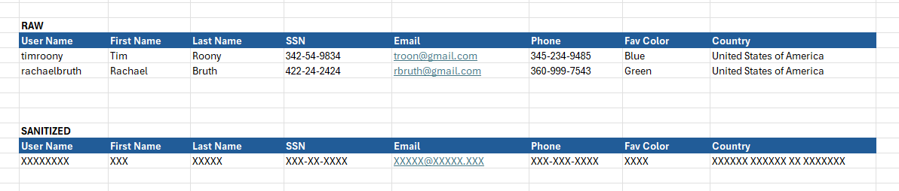

# MetalMask
A Data Masking framework that ai can understand

<br>



<br>

# Python Package

```python
import metalmask as mm

# -- configure sensitive data configuration
mm.CFG.openai_api_key = "sk-........."
mm.CFG.sensitive_types = [
    "social security number",
    "email",
    "username",
    ""
]

# -- check if value should be masked
need_to_mask_yes = mm.is_sensitive("johnyp@gmail.com")
need_to_mask_no  = mm.is_sensitive("just some random string of data")

# -- mask a single value
ssn = "234-24-2323"
mask_ssn = mm.mask(data_ssn)

# -- mask a row

# -- mask a column

# -- mask a txt file

# -- mask a dataframe

# -- mask a json file 
```

<br>


# RULES
### Framework
-  convert all non-alpha-numeric values to x
-  preserve length of original value
-  
-  


### System Prompt
```
```